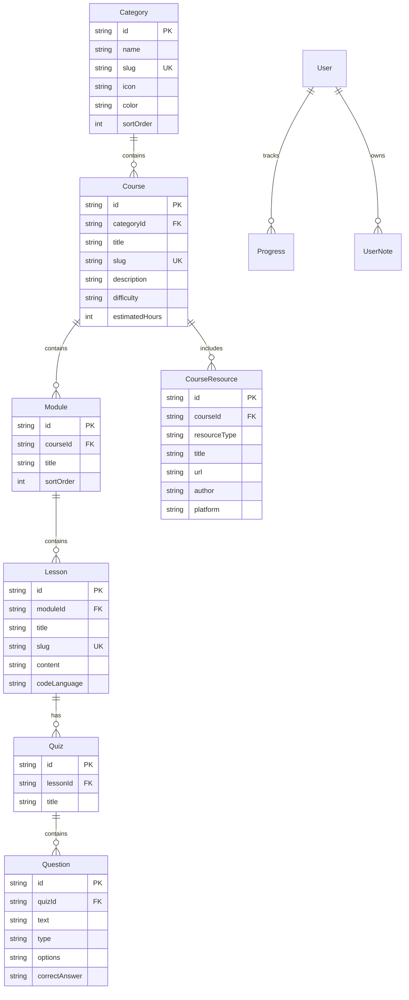

# 📘 Code Mentor PRO — GitHub Wiki & Technical Manual

Welcome to the **Code Mentor PRO Technical Documentation Wiki**. This guide provides in-depth technical specifications, database Entity-Relationship (ER) schemas, API route definitions, compiler execution architecture, and mobile/desktop deployment pipelines.

---

## Table of Contents
1. [System Architecture Overview](#system-architecture-overview)
2. [Database Schema & Models](#database-schema--models)
3. [REST API Route Specifications](#rest-api-route-specifications)
4. [In-Browser Compiler Sandbox Engine](#in-browser-compiler-sandbox-engine)
5. [AI Assistance Integration](#ai-assistance-integration)
6. [Mobile & Desktop Build Pipelines](#mobile--desktop-build-pipelines)

---

## 1. System Architecture Overview

Code Mentor PRO is designed around a modern decoupled web architecture using **Next.js 16 App Router**, **Prisma ORM**, and **Electron/Capacitor wrappers**.

```text
┌━━━━━━━━━━━━━━━━━━━━━━━━━━━━━━━━━━━━━━━━━━━━━━━━━━━━━━━━━━━━━━━━━━━━━━━━━━━━━┐
│                            CLIENT LAYERS                                    │
│  ┌──────────────────────┐  ┌──────────────────────┐  ┌───────────────────┐  │
│  │   Next.js Web App    │  │ Electron Desktop App │  │ Capacitor Mobile  │  │
│  └──────────┬───────────┘  └──────────┬───────────┘  └─────────┬─────────┘  │
└━━━━━━━━━━━━━│━━━━━━━━━━━━━━━━━━━━━━━━━│━━━━━━━━━━━━━━━━━━━━━━━━│━━━━━━━━━━━━┘
              └─────────────────────────┼────────────────────────┘
                                        ▼
┌━━━━━━━━━━━━━━━━━━━━━━━━━━━━━━━━━━━━━━━━━━━━━━━━━━━━━━━━━━━━━━━━━━━━━━━━━━━━━┐
│                           SERVER & API LAYER                                │
│   Next.js Server Components & Route Handlers (/api/courses, /api/run-code) │
│   Auth Middleware (JWT `jose` & `bcryptjs`)                                 │
└━━━━━━━━━━━━━│━━━━━━━━━━━━━━━━━━━━━━━━━│━━━━━━━━━━━━━━━━━━━━━━━━│━━━━━━━━━━━━┘
              ├─────────────────────────┼────────────────────────┤
              ▼                         ▼                        ▼
┌━━━━━━━━━━━━━━━━━━━━━━━━━━┐ ┌━━━━━━━━━━━━━━━━━━━┐ ┌━━━━━━━━━━━━━━━━━━━━━━━━━━┐
│ Prisma ORM / SQLite DB   │ │ Monaco Code Engine│ │ Gemini AI & Claude APIs │
└━━━━━━━━━━━━━━━━━━━━━━━━━━┘ └━━━━━━━━━━━━━━━━━━━┘ └━━━━━━━━━━━━━━━━━━━━━━━━━━┘
```

---

## 2. Database Schema & Models

Code Mentor PRO uses **Prisma ORM** with **SQLite** for zero-config local/offline operation (and PostgreSQL for cloud production).



---

## 3. REST API Route Specifications

| HTTP Method | Route | Description | Auth Required |
| :--- | :--- | :--- | :--- |
| `GET` | `/api/courses` | List all categories, courses, and lecture counts | No |
| `GET` | `/api/courses/[slug]` | Fetch course detail with modules, sublessons, & 10+ resources | No |
| `GET` | `/api/lessons/[id]` | Get detailed lecture content, starter code, and quiz data | No |
| `POST` | `/api/run-code` | Execute code in sandbox (Python, JS, TS, C++, Java, SQL, Go) | No |
| `POST` | `/api/ai/hint` | Generate AI hint or explanation using Gemini AI / Claude API | Yes |
| `POST` | `/api/auth/register` | Register new user account with hashed credentials | No |
| `POST` | `/api/auth/login` | Authenticate user and issue JWT session cookie | No |
| `GET` | `/api/progress` | Fetch current user completion progress, XP, and streaks | Yes |
| `POST` | `/api/certificate` | Generate downloadable PDF certificate upon course completion | Yes |

---

## 4. In-Browser Compiler Sandbox Engine

The Compiler Playground at `/compilers` supports 15+ programming language execution modes:

1. **JavaScript / TypeScript / HTML / CSS**:
   Executed 100% locally inside an isolated browser iframe or V8 engine context.
2. **Python / Data Science**:
   Executed via Pyodide / WebAssembly in-browser or local Node.js process runner.
3. **C++, Java, Rust, Go, C, PHP, Ruby, SQL, Bash**:
   Executed via `/api/run-code` endpoint or client-side WebAssembly compilers.

---

## 5. AI Assistance Integration

Code Mentor PRO includes integrated AI APIs (**Gemini AI API** & **Anthropic Claude API**):
- **Real-Time Code Hints**: Analyzes student error tracebacks and offers hints without giving away complete solutions.
- **Code Explanation**: Explains complex algorithms, syntax, and memory management concepts in simple terms.
- **Automated Quiz Generation**: Dynamically constructs practice questions based on current user performance.

---

## 6. Mobile & Desktop Build Pipelines

### Windows Desktop App (.exe)
Built using Electron and `electron-builder`:
```bash
npm run build
npx electron-builder --win --x64
```
Outputs standalone executable in `dist/win-unpacked/electron.exe`.

### Android APK & iOS IPA
Built using Capacitor 6:
```bash
npm run build
npx cap add android
npx cap open android   # In Android Studio: Build > Build APK
```
Outputs installable APK in `android/app/build/outputs/apk/debug/app-debug.apk`.
